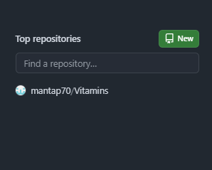
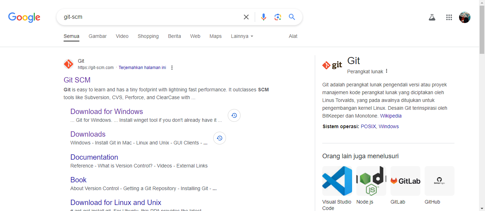
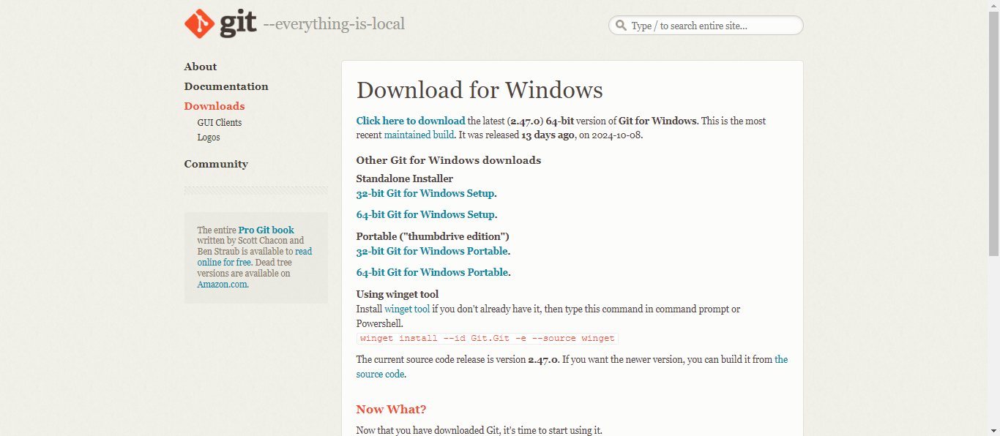
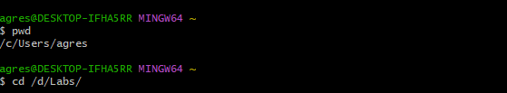
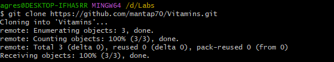
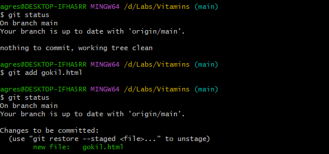
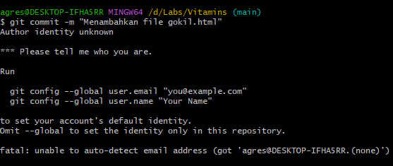
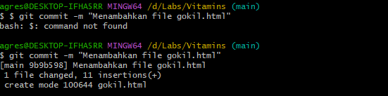
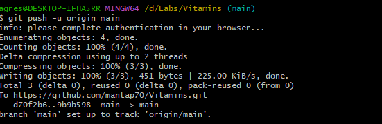

# Vitamins

## Membuat Akun Github dan Repositori

Pertama tama buatlah akun github di "github.com" terlebih dahulu
jika sudah nanti akan ada menu profile seperti ini:

jika sudah lalu klik "create repository"

karena saya sudah membuat repositori maka tulisannya new, jika belum ada
repositori tulisannya akan menjadi "Create Repository"

Namai repositori dengan apapun lalu ceklis pada bagian "Add README.md file"

## Mendownload git-scm
setelah repositori dibuat selanjutnya adalah mendownload git-scm

lalu klik download for windows jika menggunakan windows

lalu klik "Click here to download"
lalu tinggal tunggu dan install

## Melakukan clone
setelah mendownload dan menginstall selanjutnya buka git bash nya lalu masukkan pwd kemudian enter. setelah itu kita masuk kedalam directory pastikan membuat folder terlebih dahulu. Pada gambar dibawah saya sudah membuat sebuah folder di penyimpanan D: dengan nama "Labs"

setelah itu tekan gambar kode yang ada di github

lalu pada HTTPS salin link yang tertera setelah itu kembali ke git bash dan ketikan "git clone (kemudian paste link tadi)" seperti ini:

kemudian masuk kedalam repository

## Menambahkan file atau folder

sebagai contoh saya membuat sebuah file html bernama "gokil.html". jika dilihat dari gambar diatas, ketika saya memasukkan git status akan muncul "nothing to commit" lalu setelah saya menambahkan file html saya cara nya seperti diatas "git add (nama file yang akan ditambahkan) lalu masukkan git status lagi nanti git status akan mendeteksi kalau ada file yang di tambahkan bernama "gokil.html". jika sudah lanjut ke langkah berikutnya

masukkan git commit lalu "-m" kemudian tanda petik untuk menambahkan comment. jika baru pertama kali akan muncul seperti diatas. cara mengatasinya adalah tinggal memasukkan git config seperti yang berada di bawah "Run" pada gambar diatas lalu masukkan email dan juga username.

lalu jika anda memasukkan git commit sekali lagi maka hasilnya akan seperti gambar diatas. lalu lanjut ke langkah berikutnya:

lalu masukkan "git push -u origin main" kemudian tekan enter maka hasilnya akan seperti pada gambar diatas kemudian refresh browser page anda di github lalu kemudian file akan muncul pada repository anda.

### *Lakukan dari langkah git add untuk setiap file baru yang anda tambahkan

# Terima Kasih