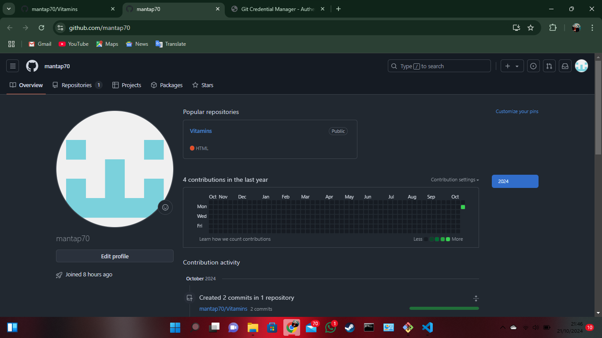

# Vitamins

## Membuat Akun Github

Pertama tama buatlah akun github di "github.com" terlebih dahulu
jika sudah nanti akan ada menu profile seperti ini:

jika sudah lalu klik "create repository"

karena saya sudah membuat repositori maka tulisannya new, jika belum ada
repositori tulisannya akan menjadi "Create Repository"